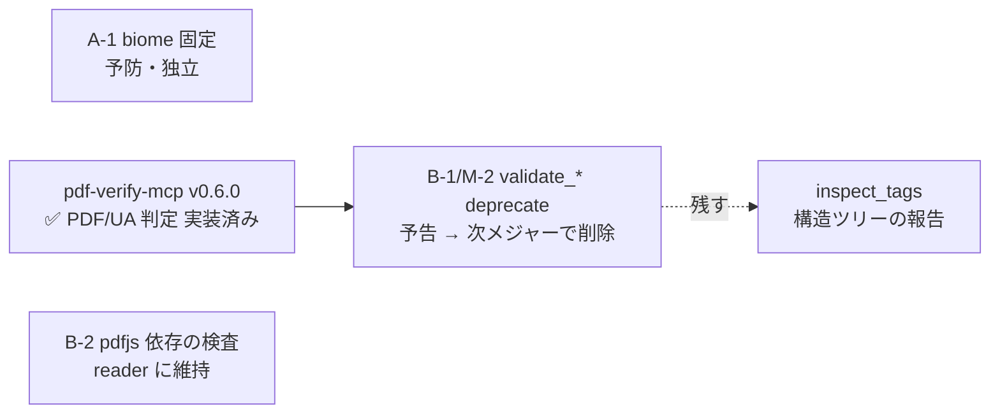

# pdf-reader-mcp 残タスクリスト

| 項目 | 内容 |
|------|------|
| 作成日 | 2026-07-16 |
| 最終更新 | 2026-07-20（#18 = R-5 の本解決を反映） |
| 現状 | **v0.9.0**・**17 ツール**（3 tier）・npm 公開済み・**npx で公開版検証済み**。加えて **#18 が `[Unreleased]` に載っている**（未リリース） |
| 基準 | `mcps/pdf-family-role-architecture.md`（責務分担提案）／ `Document-Note/mcps/PDFfamily/` |
| 備考 | pdf-verify-mcp v0.6.0 / pdf-writer-mcp v0.4.0 の作業で判明した課題を含む |
| **次の最優先** | **#18（R-5 の本解決）のリリース**。実装・テストは済んでいて `[Unreleased]` にある。以降は family の進行順に従う（reader 単体で残るのは次メジャーでの `validate_*` 削除だけ） |

## 現在地（2026-07-19）

**リリース済み**:

| 版 | 内容 |
|----|------|
| v0.7.0 | 仕様適合の D 系一括修正（High 3 / Medium 2 / Low 1）+ `validate_*` 非推奨予告 + biome/README |
| v0.8.0 | **M-8 `extract_structured_text`** 新設 + C-1（`inspect_tags` の疑似 Root ノード解消・破壊的変更） |
| v0.9.0 | spec ⇄ reader 相互チェックで挙がった **Issue #14〜#17** の一括対応（#14 `extract_tables` の walker 載せ替え = 破壊的変更／#15 ActualText の明示 + note／#16 セル `\|` エスケープ／#17 ページ列の範囲圧縮） |

いずれも npx でクリーン取得した公開版を実機で叩いて確認済み（handshake 0.9.0・17 ツール）。

**未リリース（`[Unreleased]`）**:

- ✅ **R-5 の本解決** — #18 で決着。#15 は「`read_text` / `search_text` は生グリフである」
  ことを明示して閉じたが、**同一サーバ内で答えが割れる状態自体は残っていた**。#18 で §14.9.4 の
  2 経路（構造要素 / `Span` マーク付きコンテンツ）をどちらも解決した。経路 2 は pdfjs が property
  list を捨てるため**コンテンツストリームを自前で走査**し、`BMC`/`BDC`/`EMC` の**出現順インデックス**で
  pdfjs のマーカーと突き合わせる（数が合わないページは経路 2 を諦めて生グリフに戻す）。
  R-14.9.4-3（連続 ActualText 間に語区切りを入れない）も実装済み。

**残っているもの**:

- 次メジャーでの `validate_tagged` / `validate_metadata` 削除（B-1 のステップ 3）

> **family の進行順**: 2026-07-19 時点で spec / reader / verify / writer の再監査は一巡した。
> reader は「学習データ工場のラベル源」（`specs/00` §0）なので、**誤答が見つかったときは
> 他 MCP より優先する**という原則は維持する。現在地の正典は `specs/00-overview.md` 末尾の付記。

## 次にやること（2026-07-18 時点の記録・以下は全て消化済み）

### セッション 1（バグ修正・境界が明確・すぐ出せる）✅ 完了（2026-07-18・v0.7.0 で公開）

**D-1（High-1）→ D-2（High-2）→ B-1（M-2）**、＋実機試用で発見した **D-9（High-3）**、
＋ shuji さんの指示で **D-3（Medium-1）**。実測で白黒がついた。

- **D-1 / D-2 / D-9**: 修正済み。**3 件とも根本原因は「そのケースを踏むフィクスチャが無かった」こと**。
  - D-1: 既存フィクスチャは全て `StandardFonts`（単純フォント）で **Type0 を含む PDF が 1 つも
    無かった** → `cid-font.pdf` を追加（埋め込み / 非埋め込み / DescendantFonts 欠落 ＋ Helvetica）
  - D-2 / D-9: 画像プロパティを検証する IM-3 が `if (extractedCount > 0)` で囲まれ、**0 件なので
    空振りで緑**だった → ガードを撤去し `image-kinds.pdf` を追加（RGB / RGBA / 1bpp を 1 枚ずつ）
- **D-9 は実機試用でしか出なかった**。単体テストも E2E も緑、`check` も緑、`typecheck` も緑のまま
  **tier1 ツールが 1 枚も返していなかった**。**ツールを実際に叩く工程を省略しないこと**
- **D-9 の 2 段目（commonObjs）は「緑だが 10 秒」というタイミングだけが兆候だった**。
  テストの所要時間がタイムアウト値ときっちり一致していたら、それは**握り潰された失敗**。
  「通ったが遅い」を見逃さないこと。タイムアウトは非常用であって、常用の経路にしない
- **B-1**: **「畳む」を選択**（D-6 / D-7 は直さない）。description に予告を追記。動作は不変・削除は次メジャー
- **実機確認済み（local MCP・build 後）**: `inspect_fonts` が日本語 PDF で `isEmbedded: true`。
  deprecation 予告もツール説明に反映
- **⚠️ ホストでの実行が未完**: サンドボックスでは `tsc` / `vitest` / `biome` が動かないため
  （[[no-npm-install-in-sandbox]]）、**`npm run test:fixtures` → `npm run test:e2e` → `npm run test`
  → `npm run check` はホストで未実行**。リリース前に必ず通すこと（D-9 の修正後は特に
  `test:fixtures` の再実行が必須 — `image-kinds.pdf` が無いと IM-3/5/6/7 が落ちる）

### セッション 2（新ツール・「決める」作業）✅ 完了（v0.8.0 で公開）

**D-5（M-8 = `extract_structured_text`）**。**セッション 1 と混ぜないこと** —
仕様が Draft v0.1 で設計判断が要り、混ぜると両方が雑になる。
また D-1 を M-8 の設計議論の**人質にしない**（writer で B-10a を監査の人質にしなかったのと同じ）。
なお「D-1 と M-8 は同一ファイル」は**並行作業を避ける**理由であって同時にやる理由ではない。
1 → 2 の順なら衝突しない。

## D. 仕様適合（`docs/spec-conformance-review-2026-07-17.md` 由来）

> pdf-spec-mcp（ISO 32000-2 / PDF/UA-1）との照合で判明。**レポートに修正案・実証・該当ファイルまで
> 書いてある**ので、着手時は必ず先に読むこと。ここは索引に過ぎない。

- [x] **D-1. 🔴 High-1: `inspect_fonts` が Type0 の埋め込みを常に false と誤判定**【実証済み】
      → **修正済み（2026-07-18・v0.7.0 で公開）**。`Subtype == Type0` なら `DescendantFonts[0]` を解決し
      CIDFont の `FontDescriptor` を見る。回帰テスト IF-5〜IF-8（`cid-font.pdf`）。
      条文の再確認: FontDescriptor がある CIDFont 辞書は **Table 115**（レポートの「Table 116」は誤記）。
      「`DescendantFonts[0]` でよい」根拠は §9.7.6.2「In PDF, the font number shall be 0」＋
      Table 119「a one-element array」
      `src/services/pdflib-service.ts` `analyzeFontsWithPdfLibImpl`。
      **原因**: Type0 フォント辞書（Table 119）には `FontDescriptor` が**無い**。実体は
      `DescendantFonts` の CIDFont 辞書側にある（§9.7.4.1 Table 116 で
      "Required; shall be an indirect reference"）。そこを見ずに Type0 辞書自体を見ている。
      **影響**: **日本語 PDF はほぼすべて Type0** であり、「PDF/A・PDF/X 向けの埋め込み確認」という
      ツール説明に明記した主要ユースケースで誤答する。
      **修正案**: `Subtype == Type0` なら `DescendantFonts[0]` を解決し、その CIDFont の
      `FontDescriptor` を見る。
      **回帰テストの作り方**: writer で NotoSansJP を埋め込んだ PDF を生成 → `isEmbedded: true` を要求
- [x] **D-2. 🔴 High-2: `read_images` の pdfjs ImageKind 誤マッピング**
      → **修正済み（2026-07-18・v0.7.0 で公開）**。`describeImageKind()` に切り出し、
      **`ImageKind` を pdfjs から import**（マジックナンバー直書きが事故の原因だったため）。
      1bpp では `bitsPerComponent: 1` を返す。未知の kind は `'Unknown'`。
      単体テスト 5 件（pdfjs 側の定数が将来ずれたら気付けるガードを含む）＋
      新フィクスチャ `image-kinds.pdf` で 3 種を実データ検証（IM-6 / IM-7）。
      **注: D-9 を直すまでこの経路には到達しなかった**（下記）
- [x] **D-9. 🔴 High-3（新規・実機試用で発見）: `read_images` が画像を 1 枚も抽出できない**
      → **修正済み（2026-07-18・v0.7.0 で公開）**。`src/services/pdfjs-service.ts` `extractImages`。
      **原因は 2 つ重なっていた**:
      ① 画像は worker から**非同期に**届くため、同期形式の `page.objs.get(name)` が
      `Requesting object that isn't resolved yet` を投げ、`catch {}` が飲み込んで全件 skipped に
      していた。**全 PDF で `extractedCount: 0`** ＝ tier1 ツールが実質不動だった。
      → コールバック形式＋タイムアウト（10 秒）へ。
      ② **ページ間共有の画像は `page.objs` ではなく `page.commonObjs`**（pdfjs は `g_` 接頭辞で示す。
      例 `g_d0_img_p2_1`）。①だけではタイムアウトまで待って取りこぼしていた
      （**テストは緑のまま 1 件 10 秒**かかっており、それが唯一の兆候だった）。
      → pdfjs 自身の `getObject` と同じ `name.startsWith('g_') ? commonObjs : objs` で分岐。
      `comprehensive_1.pdf` は **10 秒 → 52ms・2/2 枚**に。回帰テスト IM-8。
      **誤ったエラーメッセージも是正** — 「encoding format が直接アクセスできない」と
      **ファイル側の性質のように断言**していたが、実際は自分のバグで、pdfjs が問題なく
      デコードできる PNG でも同じ文言が出ていた。
      **教訓（D-1 と同型）**: 唯一プロパティを検証する IM-3 が `if (extractedCount > 0)` で
      囲まれており、**0 件なので本体ごとスキップされ空振りで緑**だった。これが High-2 も同時に
      隠していた。**「テストが緑」は「テストが走った」を意味しない**
- [x] **D-3. Medium: `isValidPdfDate` の `[+-Z]` が範囲指定バグ / `HH'`（分なし）を拒否**【実証済み】
      → **修正済み（2026-07-18・v0.7.0 で公開。shuji さんの指示で「直す」を選択）**。
      **誤受理 10 件・誤拒否 2 件**を是正。単体テスト 34 件（`tests/tier1/validation-service.test.ts`）。
      正規表現を条文のフィールド定義から組み立て直し、各行に根拠を併記した。
      **値域検査も追加** — 旧実装は全フィールド `\d{2}` で **月13・日00・時24・分60・秒60 を
      「有効」と報告**していた（レビューが「さらに厳密には…も検討」としていた部分）。
      **条文の不整合を発見**: §7.9.4 の EXAMPLE `D:199812231952-08'00` は **SS を省略したまま
      オフセットを付けており**、同項の「preceding fields」規定と矛盾する。**ISO 32000-1:2008 に
      同一の規定文・同一の EXAMPLE** を確認したので版差ではなく規格側の長年の不備。
      **SS の省略のみ例外として受理**（規格自身の EXAMPLE を warning にするのは不合理）。
      なお `isValidPdfDate` を export した（private だと 1 形式 1 フィクスチャが必要になるため）
- [x] **D-4. Medium: `inspect_annotations` が Popup を markup 扱い / FileAttachment・Sound・Projection 漏れ**
      → **修正済み（2026-07-18・v0.7.0 で公開）**。**根拠は Table 172 ではなく Table 171 の "Markup" 列**
      （レビューは §12.5.6.2 の散文と Table 172 を根拠にしていたが、**Table 171 に型ごとの
      Markup 列が規定として存在する** — 散文から推測する必要はなかった）。全 28 型をそのまま転記。
      `Redact` も "Yes"（レビューの「＋redaction」は正しかった）。単体テスト 33 件で全型を固定
- [x] **D-6. Medium: `validate_metadata` が XMP dc:title / DisplayDocTitle / Suspects 未検査**（Info 辞書のみ）
      → **直さない（B-1 で「畳む」を決定・2026-07-18）**。次メジャーで削除するツールに PDF/UA 検査を
      足すのは二重投資。判定は verify の `validate_conformance` に委ねる。
      ただし**誤った規格上の主張は description から除去した** — 「Title presence (required for PDF/UA,
      PDF/A)」は根拠にならない（PDF/UA-1 §7.1 が要求するのは XMP の `dc:title`、Info 辞書は
      "shall ignore"）。未検査である旨も明記済み
- [x] **D-7. Low ×3**: TAG-005（Figure の Alt/ActualText 未検査）/ TAG-004（見出しが「存在集合」ベースで
      順序未検査）→ **直さない（同上）**。どちらも `validate_tagged` の中で、verify が上位互換を提供済み。
      **`analyzeStructure` の `/Version` 無条件優先だけは別件として残る** — これは deprecate 対象外の
      `inspect_structure` の話。↓ D-8 に再掲
      - **2026-07-18 追記（M-8 出荷後の再評価）: reader 側に残る作業は無い。**
        観測（reader の責務）と判定（verify の責務）に分けると、**観測の半分は M-8 が吸収済み**:
        - TAG-005 → M-8 が `alt` フィールドで Figure の代替テキストを**そのまま返す**。判定は verify の
          `validate_conformance`（`/Alt`・`/ActualText` を検証済み）。
        - TAG-004 → M-8 は**深さ優先の論理順**で要素を返すので、H1/H2/H3 の並びが直接見える。
          「存在集合ゆえ出現順が見られない」という TAG-004 の弱点は M-8 が解消した。
        残る「判定の半分」は verify の領分で、**verify #4（判定の所在）に依存する**。
        独立して着手できる未実装の中間ピースは存在しない → **D-7 として新規に作るものは無い**。

- [x] **D-8. Low: `analyzeStructure` が `/Version` をヘッダ版数と比較せず無条件優先**
      → **修正済み（2026-07-18・v0.7.0 で公開）**。`resolvePdfVersion()` に切り出し（export・単体テスト 8 件）。
      Table 29 は「If the header specifies a later version, or if this entry is absent, the document
      **shall conform to the version specified in the header**」と規定。**同版のときもヘッダに従う**
      （catalog は "later" ではない）。**minor は数値比較**にした — 文字列比較だと `1.10 < 1.7` で誤る

## E. 新ツール

- [x] **D-5（M-8）. `extract_structured_text`（構造付きテキスト抽出）**
      → **実装済み（2026-07-18・v0.8.0 で公開）**。仕様は **specs/08 v0.2**（v0.1 をレビューして改訂）。
      レビュー: `docs/m8-spec-review-2026-07-18.md`。
      **走査は `StructTreeRoot` 深さ優先**（`src/services/struct-tree-service.ts`）。
      v0.1 の「`extract_tables` の一般化」は**採らなかった** — ページ単位併合では logical content
      order を出せず、ページ跨ぎ要素が分裂する（実証済み）。構造は pdf-lib・テキストは pdfjs。
      出力はフラット + `depth`（`Table` のみ `rows`）。`ActualText`/`Alt`/`Lbl` を分離。
      **実装中に見つけた 3 つ**（すべてフィクスチャ/実機で発見）:
      ① 既存 `tagged.pdf` は marked content が無い偽タグ付き → 本物 `structured.pdf` を新造。
      ② ページ境界の空白落ち（pdfjs はページ先頭に EOL を出さない）。
      ③ **日本語の CJK 空白混入**（実機の日本語 PDF で発覚）— 改行が MCID の境界に落ちるため、
      単体テストが `\n` 直渡しで空振りしていた。`buildIdToTextMap` を raw 保持にして結合後に解決、
      `extract_tables` と共通化。CJK レンジの穴（`。`U+3002 が漏れ）も同時修正
- [x] **D-5 の副産物: `inspect_tags` の C-1 を解消**（specs/08 §3.5）
      → **実装済み（2026-07-18・v0.8.0 で公開・破壊的変更）**。
      同じ walker に載せ替え、疑似 `Root` ノードを廃止。2 ページ文書で `Document` は 1 つ、
      ページ跨ぎ要素はまるごと。`validate_tagged`（deprecated）用の `analyzeTagsFromDoc` は温存

## A. 運用系

### A-1. biome のバージョンを固定する ✅ 完了（2026-07-18・v0.7.0 に含む）

> `package.json` を `2.5.4` 固定、`biome.json` の `$schema` も `2.5.4` に更新済み。
> **ホストでの `npm install` が必要**（実体は 2.5.3 のため）。
> これで family 3 リポジトリすべて 2.5.4 固定に揃った。以下は経緯。

**症状**: `package.json` は `^2.3.14`、lockfile と実体は **2.5.3**、`biome.json` の `$schema` は
**2.3.14** と三者がバラバラ。

**なぜ問題か**: biome は **minor 更新で整形結果が変わる**。キャレット指定だと手元の
`npm install` が CI より先に進み、**誰も触っていないファイルに format 差分が出る**。

**実績**: pdf-verify-mcp で実際に発生した（2026-07-16）。`^2.3.14` 指定のまま実体が 2.5.4 に上がり、
半年前にコミットされた `decryptor-qpdf.test.ts`（`it.each([...])` の整形）が突然エラーになった。
原因調査に時間を取られたため、同じ轍を踏まないこと。

**現状**: 2.5.3 では整形は無事（`biome check` は警告 1 件のみ）。**次の minor で再発しうる**。

**対応**:

```bash
npm pkg set devDependencies.@biomejs/biome="2.5.4"   # キャレットを外す（family は 2.5.4 に統一）
# biome.json の $schema を https://biomejs.dev/schemas/2.5.4/schema.json に更新
npm install
npm run check          # 差分が出たら npm run check:fix
```

**family の状況**: pdf-writer-mcp / pdf-verify-mcp は **2.5.4 固定済み**（2026-07-16）。
本リポジトリだけキャレット指定が残っている。

### A-2. README の npx 設定例に `@latest` を付ける ✅ 完了（2026-07-18・v0.7.0 に含む）

> README (en/ja) の `npx` 直叩き例・Claude Desktop 設定例・`claude mcp add` 例の 3 箇所を
> `@latest` に更新し、キャッシュの注意書きを追記した。`.claude-plugin/plugin.json` は対応済みだった。
> 以下は経緯。

**症状**: README の設定例が `"args": ["-y", "@shuji-bonji/pdf-reader-mcp"]` とバージョン指定なし。

**なぜ問題か**: `npx -y <pkg>` の `-y` は**インストール確認を省くだけで、更新確認はしない**。
一度取得した版がキャッシュに残り、**新版を publish しても古い版が動き続ける**。

**実績**: pdf-writer-mcp で実際に発生した（2026-07-16）。npm には 0.5.0 が公開済みなのに
npx は 0.4.0 を使い続け、新機能（`tagged`）がツール一覧に現れなかった。
`rm -rf ~/.npm/_npx` + 再起動で解消。

**対応**: README（en/ja）の設定例を `@shuji-bonji/pdf-reader-mcp@latest` にし、
キャッシュの注意書きを添える。pdf-writer-mcp / pdf-verify-mcp は対応済み（2026-07-16）。

### A-3. リポジトリ直下の調査用スクリプトの整理

`repro-*.mjs` / `repro-*.ts` / `gen-twocol.mjs` / `repro-encrypted.pdf` /
`pdf-reader-mcp-verification-report.md` がルートに散在している。
`tests/fixtures/` か `scripts/` へ移すか、役目を終えたものは削除する。

## B. family 連携（`mcps/pdf-family-role-architecture.md` 由来）

### B-1（M-2）. `validate_tagged` / `validate_metadata` の deprecation — ✅ ステップ 1・2 完了

> **決定（2026-07-18）: 「畳む」**。D-6 / D-7 は**直さない**。判定は verify に委ねる。
> 波及: D-3 は呼び出し元が `validateMetadata` だけと判明したが、**「直す」を選択して修正済み**
> （↑ D-3 参照）。**畳む決定は D-6 / D-7 にのみ適用**した。
> D-7 の `/Version` だけは deprecate で消えないので **D-8 として分離**した。
>
> 実施済み: ① description に予告＋verify への誘導を追記（**動作は不変**）／
> ② CHANGELOG に経緯を記録。**③ 次メジャーでの削除は未実施**。
> あわせて `validate_metadata` の description から**誤った規格上の主張を除去**した
> （「Title presence (required for PDF/UA, PDF/A)」→ Info 辞書は PDF/UA の根拠にならない）。

**背景**: family の境界ルールは「**ISO 規格に照らした合否を返すなら verify、観測を返すだけなら
reader**」。Tier 3 の `validate_*` は verify が存在しなかった時代の実装で、この規則の例外だった。

**状況**: pdf-verify-mcp **v0.6.0（2026-07-16）で PDF/UA 判定を実装済み**。
`validate_conformance` に `flavour: "pdfua-1" / "pdfua-2"` が入り、veraPDF 委譲＋ネイティブ 12 規則で
判定する。**単なる移植ではなく上位互換**:

| 項目 | reader `validate_tagged` | verify `validate_conformance` |
|------|--------------------------|-------------------------------|
| Figure の alt text | **個数のみ**（`/Alt` を読んでいない） | `/Alt` / `/ActualText` の実在を検証 |
| Link の `/Contents` | 見ていない | 検証する |
| StructTreeRoot | ページ経由の合成（catalog 未確認） | catalog を直接検査 |
| 条項参照 | なし | ISO 14289 の条項付き |
| veraPDF | 連携なし | あれば委譲（106 規則の権威ある判定） |

**対応（段階的・破壊的変更を避ける）**:

1. ✅ `validate_tagged` / `validate_metadata` の description に **deprecation 予告**と
   verify への誘導を追記する（削除はしない）— 2026-07-18 実施
2. ✅ `CHANGELOG.md` に移管の経緯を記録 — 2026-07-18 実施
3. ⬜ 次のメジャーで削除 — **未実施**

**保持すべきもの**: `inspect_tags` は**残す**。構造ツリーの報告は「事実」であり reader の責務。
verify は pdfjs を持たないため、構造ツリーそのものの調査は本サーバでしかできない。

### B-2. pdfjs 依存の検査は本サーバの資産として維持

verify は依存を軽く保つ設計（pdf-lib + pkijs のみ）のため、pdfjs が必要な検査は移管しない。

- 見出し階層の**順序**判定（構造要素の再帰走査）
- 画像と Figure タグの対応（`getOperatorList` + `OPS.paintImageXObject`。
  インライン画像 `BI...ID...EI` はコンテンツストリーム解析が必要）

これらは reader に残すのが合理的。

> **2026-07-18 追記（M-8 出荷後）: この節は M-8 より前の記述。**
> 「見出し順序の資産を reader に残す」という意図は、**M-8（`extract_structured_text`）が
> `StructTreeRoot` を深さ優先で走査し、論理順の要素列を返すことで既に達成された**
> （しかも pdfjs ではなく pd-lib で。テキスト解決のみ pdfjs）。
> つまり B-2 が守りたかったものは M-8 が提供済みで、D-7（`validate_tagged` は直さない）とも矛盾しない。
> 「画像と Figure タグの対応」は M-8 の範囲外（Figure の `alt` は返すが、Figure タグと実画像の
> 対応付けは別）なので、**こちらは依然 reader の未使用資産**として残る（着手予定は無い）。

## C. 品質

### C-1. 構造ツリー取得方法（ページ単位併合の疑似ノード）— ✅ 修正済み（2026-07-18・M-8 と同時）

ページごとの `page.getStructTree()` をマージする方式のため、`rootTag` は疑似ノードだった。
2 ページの文書で `Root`・`Document` を 2 つずつ返し、ページ跨ぎ要素を分裂させていた。
→ **当初は「`validate_tagged` を deprecate するので放置」と判断していたが、M-8 のレビューで
`inspect_tags`（存続ツール）も同じ欠陥を持つと判明**（specs/08 §3.5）。M-8 の `StructTreeRoot`
walker に載せ替えて解消。`inspect_tags` は `Document` 1 つ・ページ跨ぎ要素まるごとを返す。
**`validate_tagged` 用の `analyzeTagsFromDoc`（pdfjs ページ単位）は deprecated なので温存**。

## 依存関係


