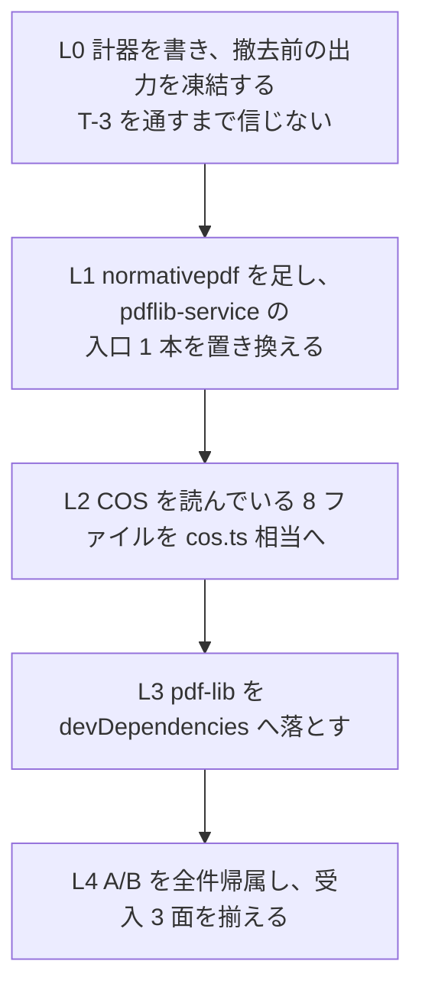

# reader の pdf-lib 撤去（family 第 3 弾）— 着手前の 1 枚

> **この 1 枚を読めば別セッションで始められる形にしてある。**
> 先行 2 件の記録: writer = `lib/normativepdf/docs/handoff/phase3-pdflib-removal.md`、
> verify = `mcp/pdf-verify-mcp/docs/handoff/pdflib-removal.md`（+ `scope-in-output.md`）。
>
> 実測日 2026-08-29。reader **0.13.0** / normativepdf **0.9.0**。

## 1. いま何が載っているか（実測）

```
pdf-reader-mcp 0.13.0   src 46 ファイル・10,959 行
dependencies: @modelcontextprotocol/server ^2.0.0 / pdf-lib ^1.17.1
              pdfjs-dist ^4.9.155 / zod ^4.2.0
normativepdf: 入っていない
```

`pdf-lib` に触れているのは **src の 10 ファイル・約 5,700 行**。

| ファイル | 行 | pdf-lib の出現 |
|---|---:|---:|
| `services/pdflib-service.ts` | 562 | 77 |
| `services/content-stream-service.ts` | 701 | 56 |
| `services/struct-tree-walker.ts` | 319 | 56 |
| `services/object-locator.ts` | 392 | 50 |
| `services/pdfjs-service.ts` | 1,583 | 29 |
| `services/text-extractability-service.ts` | 349 | 29 |
| `services/struct-tree-service.ts` | 803 | 15 |
| `types.ts` | 590 | 2 |
| `services/actual-text-service.ts` | 248 | 1 |
| `tools/tier1/search-text.ts` | 111 | 1 |

`pdflib-service.ts` が入口で、**8 ファイルがそこを import している**
（tools 3 本 + services 5 本）。公開している関数は 6 つ:

```
loadWithPdfLib / loadWithPdfLibFromData / detectEncryption
analyzeStructure / analyzeFontsWithPdfLib / analyzeSignatures / resolvePdfVersion
```

import している pdf-lib の型は COS の 8 種だけ
（`PDFDict` / `PDFName` / `PDFString` / `PDFHexString` / `PDFNumber` /
`PDFArray` / `PDFRef` / `PDFStream`）。**高レベル API はほぼ使っていない** ——
verify のときと同じ形で、置き換え先は `cos.ts` 相当の読み口になる。

## 2. 🔴 pdfjs-dist は撤去対象ではない

`pdfjs-dist` はテキスト抽出とページ描画に使っており、これは別の問い。
normativepdf にテキスト抽出プリミティブは**まだ無い**
（normativepdf の ROADMAP に「需要駆動候補・着火待ち」として置いてある）。

**この作業で撤去するのは pdf-lib だけ。** 6 ファイルが pdfjs と pdf-lib の
両方に触れているので、切り分けを最初に測ること —— どの行がどちらの用事かを
混ぜたまま置き換えると、A/B の差を帰属できなくなる。

## 3. 🔴 reader には計器が無い

verify（B2）と writer（Phase 3）はゴールデンの計器を持っていたが、reader は持っていない。

```
scripts/   check-engines.mjs / check-public-types.mjs / sync-plugin-version.mjs
tests/     e2e / fixtures / tier1 / verify-*.mjs
docs/handoff/  （このファイルが最初）
```

**最初の仕事は撤去ではなく、撤去前の出力を凍結する計器を書くこと。**
verify の `scripts/golden.mjs`（take / diff / report / t3・分類 10 バケツ）が
そのまま型になる。19 ツール × コーパス 2,950 件を回すので、
**呼び出し数は verify の 20,650 より多くなる**（見積 55,000 前後）。
verify では 2,950 件 × 7 ツールで 28 秒だったので、時間は問題にならない。

計器を信じる前に **T-3（意図的に壊して差が出ることを確かめる）を通す**こと。
verify の t3 は 14 通りで、そのうち 4 つ（増えただけ / 並びだけ / 切り詰め /
増えたうえに判定も動いた）は**あとから足りないと分かって足したもの**である。

## 4. 使えるもの（B2 で作った）

`mcp/pdf-verify-mcp/src/services/` の 3 つは、reader でも同じ形で要る。

| ファイル | 役割 |
|---|---|
| `xref-walk.ts` | 相互参照チェーンの歩きと回復方針（3 段・全部申告） |
| `document.ts` | `openDocument` と `DocumentScope`（どこまで読んだか） |
| `cos.ts` | COS の読み口。判定は書かない |

✅ **決まった（2026-08-29・[ADR-0010](../../../../lib/normativepdf/docs/adr/0010-recover-package.md)）:
共有パッケージ `@normativepdf/recover` として切り出す。**
コアには入れない（回復方針は推測で、条文どおりに読むコアの立場と両立しない）。
`@normativepdf/document`（ADR-0009）はオーサリング層なので、そこでもない。

🔴 **切り出しは reader の撤去より先に行う。** reader は最初からこのパッケージの
`openDocument` / `cos` の上で書く —— コピーしてから共有に直すと、A/B の差が
「置き場所の移動」と「pdf-lib の撤去」で混ざる。
切り出しの 1 枚 = [`mcp/pdf-verify-mcp/docs/handoff/recover-extraction.md`](../../../pdf-verify-mcp/docs/handoff/recover-extraction.md)

計器 3 本も型になる: `golden.mjs` / `probe-scope.mjs` / `verapdf-oracle.mjs`。

## 5. 段取り（verify の B2 に合わせる）



各段で `diff` を採り、**差を 1 件ずつ帰属する**。数を減らすのが目的ではなく、
**説明が付いていない差を 0 にする**のが目的。

## 6. 受入 3 面（verify B2 と同じ）

| 面 | 何を見るか |
|---|---|
| **1 撤去** | `src` の pdf-lib import 0 件 / `npm ls --omit=dev pdf-lib` が `(empty)` |
| **2 出力の A/B** | 19 ツール × 全検体の差を**全件帰属**。🔴 誤った `pass`（読めていたものが読めなくなる・観測が減る）は 0 件 |
| **3 独立オラクル** | reader の答えを **別実装**に照合する。候補 = `qpdf --json` / `pdftotext` / `mutool`。**A/B が両側とも同じ欠陥を持つ場合、面 1・面 2 では見えない**（verify では写しのヘッダが `%PDF-2.0` になっていた欠陥をこれだけが捕まえた） |

面 3 の対象を先に決めること。reader の 19 ツールのうち、
**独立オラクルが立つのはどれか**を実測で決める（立たないものは「立たない」と書く）。

## 7. 環境（そのまま効く制約）

- **push は device_bash からできない**（SSH 鍵が無い）。commit + tag までがこちらの仕事
- **マウント上で `npm install` を打たない**（ホストの darwin バイナリが linux のものに置き換わる）
- ビルドとテストは**コンテナへ往復する**: マウントで tar → `device_stage_files` →
  `/tmp/vm` で `npm ci` → `tsc` / `biome` / `vitest` / `npm run build` → tar →
  `SendUserFile` → `device_commit_files` → **`cat` で 1 ファイルずつ上書き**
  （tar の展開は unlink が要るので通らない）。**dist も戻す** —— 計器は dist を読む
- `.golden/` は gitignore にして**消さない**。撤去前の基準は pdf-lib が在るうちにしか採れない
- git はマウント越しで unlink できない: `--no-optional-locks`、
  `HEAD.lock` / `index.lock` / `tmp_obj_*` を `.git/_cowork-junk/` へ退避、
  identity は `-c user.name="shuji-bonji" -c user.email="bonji@mikuro.jp"`
- publish は **tag `v*` の push で発火**（npm Trusted Publisher / OIDC）。
  🔴 `--follow-tags` を忘れると版が欠番になる（verify 0.20.0 で実際に起きた）

## 8. 先に決めること 3 つ

1. ~~B2 の 3 ファイルをコピーするか、共有に上げるか~~ → **決まった**（§4・ADR-0010）。
   `@normativepdf/recover` の切り出しが**この作業の前**に入る
2. **面 3 の独立オラクルを何にするか**、19 ツールのどれに立つか（§6）
3. **pdfjs と pdf-lib の切り分け**をどこで測るか（§2）

## 9. 先行 2 件で分かっていること（踏まないため）

- **pdf-lib の `PDFDict.has` はオブジェクトストリーム由来の鍵を外す** ——
  `get` は通るのに `has` だけ false。verify では埋め込み済みフォントを
  「未埋め込み」と誤報していた。**`fail → pass` を反射的に後退と数えない**
- **`ignoreEncryption` は復号しない** —— 構造木は歩けるが文字列は暗号文のまま
- **チェーンが途中で切れた文書を条文どおり読むと、その向こうが丸ごと消える** ——
  verify では署名 6 本のうち 5 本と失効情報が見えなくなり、判定が緩んだ。
  「文書の組み立て」と「リビジョンの一覧」は別の問いとして分ける
- **出力に項目が増えると本当の差が埋まる** —— 分類に「増えただけ」の
  バケツを用意しておく。verify では 2,947 件のうち 2,904 件がそれだった
- **計器は自分の省略を黙る** —— 差分表示の打ち切り・辞書を読み飛ばす集計で
  3 度誤報した。**「全部帰属した」は数え直して言う**
