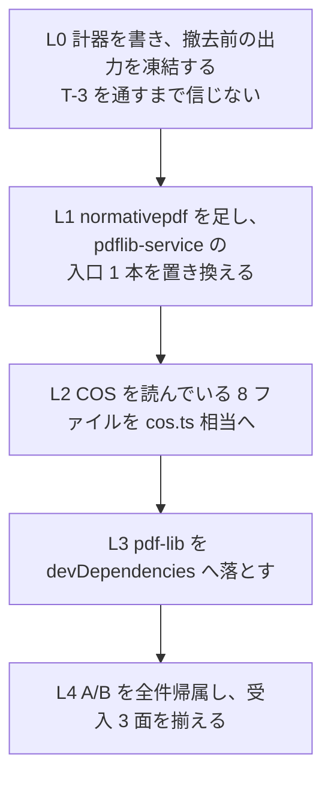

# reader の pdf-lib 撤去（family 第 3 弾）— 着手前の 1 枚

> **この 1 枚を読めば別セッションで始められる形にしてある。**
> 先行 2 件の記録: writer = `lib/normativepdf/docs/handoff/phase3-pdflib-removal.md`、
> verify = `mcp/pdf-verify-mcp/docs/handoff/pdflib-removal.md`（+ `scope-in-output.md`）。
>
> 実測日 2026-08-29。reader **0.13.0** / normativepdf **0.9.0**。
> **2026-08-31 追記: pdf-lib の撤去は終わった（L0 / L1 / S1〜S4 / L3）。
> §0 と §0.15 を先に読むこと。**

## 0. いまここ（2026-08-31）

**L0 / L1 / S1 / S2 / S3 / S4 / L3 は終わった。残るは L4 の外側だけ。**

```
面 1 撤去      src の pdf-lib import 0 件 ✅
               npm ls --omit=dev pdf-lib -> (empty) ✅
面 2 A/B       6,090 件を全件帰属・未帰属 0・誤った pass 0 件 ✅
面 3 独立オラクル  qpdf / pdftotext で 4 群を裏取り ✅
残り           版を 0.15.0 として出す（破壊的変更あり）・site の再生成・
               tier2 のツールに射程の申告が無いこと（§0.15 の借り）
```

> 別セッションで続けるなら、**§0.15「次のセッションが最初に読む所」から読む**。
> 基準ファイル・残りの段・環境の落とし穴・面 3 の叩き方がそこに揃えてある。
> この §0 の残りは、そこまでに何を測って何が分かったかの記録である。

### L1 / L2 の進み

| 段 | 移したもの | A/B |
|---|---|---|
| L1 | `detectEncryption` → `recover-service.ts` | **差 0 件**（json / markdown 両方） |
| S1 | `object-locator.ts`（`locate_objects`） | 差 91 件・全件帰属（json / markdown で同じ 91 件） |
| S2 | `struct-tree-walker` / `struct-tree-service` / `actual-text-service` | 差 23 件・全件帰属（json / markdown で同じ 23 件） |
| S3 | `content-stream-service` / `text-extractability-service`（+ `struct-tree-walker` の暗号の見方） | 差 95 件・全件帰属（json / markdown で同じ 95 件） |
| S4 | `pdflib-service` を 3 つに割って recover へ（`structure` / `font` / `signature`） | 差 6,090 件・全件帰属（json / markdown で同じ 6,090 件） |
| L3 | `pdf-lib` を devDependencies へ | `npm ls --omit=dev pdf-lib` が `(empty)` |

各段で `openPdf`（recover）と `loadWithPdfLib`（pdf-lib）が**併存する**。
移した段だけが recover で開き、残りは pdf-lib で開く。同じファイルを 2 回読むので
遅くなるが、**その段の差だけが A/B に出る**。まとめて移すと、出た差がどの段の
ものか言えなくなる。

### S1 の帰属（91 件・すべて `locate_objects#1-10`）

| 分類 | 件数 | 何が起きたか |
|---|---:|---|
| F 観測が増えた | 84 ファイル / 379 オブジェクト | `/ObjStm` と `/XRef` **自身**。pdf-lib の `enumerateIndirectObjects()` はこの 2 つを返さず「この番号のオブジェクトは存在しない」と答えていた |
| B 読めない→読めた | 2 | `%PDF-`（版が無いヘッダ）。pdf-lib は版の数を読もうとして止まっていた |
| E 観測が減った | 3 ファイル / 8 オブジェクト | 下の表 |
| G その他 | 2 | `detail.cause` の文面が条文つきに変わっただけ（`code` / `hint` / `next_actions` は同じ） |

🔴 **面 3（独立オラクル）で F の 379 件すべてを裏取りした。**
`qpdf --show-object` が返す `/Type` と **379/379 一致**。pdf-lib の
「存在しない」が誤りだったことを、reader の外側が確かめている。

> このとき照合スクリプトの側に欠陥があり、最初は **0/10 一致**と出た。
> qpdf は辞書を 2 行目に書くのに `head -1` で切っていた。
> 「合わない」と report した検査が、実際には何も読んでいなかった。

#### 読めていたものが読めなくなった 8 オブジェクト（面 2 の要注意）

| ファイル | オブジェクト | 理由 |
|---|---|---|
| `halves-fail-ok-password.pdf` | 1〜6 | 空でない利用者パスワード。鍵が導けないので **1 つも読めない**（ADR-0008）。pdf-lib の `ignoreEncryption` は復号せずに構造だけ歩いていた |
| `render-page2-never-finishes.pdf` | 8 | `/YStep -1.175e-38`。§7.3.3 は指数表記を許さないので、`e` が鍵の位置に来て `R-7.3.7-1` に反する。pdf-lib は黙って受けていた |
| veraPDF `6-1-5-t02-pass-d.pdf` | 7 | 表は名指ししているが値が **null オブジェクト**（§7.3.9）。qpdf も `null` と言う。pdf-lib の `found: true` が誤りだった |

後ろ 2 件は是正である。**残る 1 件（暗号化）は本当の後退で、判断が要る:**
空でない利用者パスワードの文書について、pdf-lib 版は `/Type` を返していた
（§7.6.2 は名前を暗号化の対象から外しているので、それ自体は正しい）。
recover は鍵が無いとオブジェクトを渡さないので、いまは
「鍵が導けなかった。パスワードを渡せ」と言って型を返さない。
利用者パスワードが空の文書（`encrypted-actualtext.pdf` など）は影響を受けない
—— recover が復号するので、むしろ文字列まで正しく読める。

### S2 の帰属（23 件）

`inspect_tags` 6 / `extract_tables` 5 / `extract_structured_text` 5 / 同 `#bbox` 5 /
`read_text` 1 / 同 `#cols2-compact` 1。**誤った pass は 0 件。**

| 分類 | 件数 | 何が起きたか |
|---|---:|---|
| B 読めない→読めた | 8 | `%PDF-`（版の無いヘッダ）2 ファイル × 4 呼び出し。S1 と同じ原因 |
| N 取り出せた文字が減った | 4 | UTF-8 のバイト順マーク（§7.9.2.2.1・PDF 2.0）。pdf-lib 1.x は PDFDocEncoding として読み、本文の頭に `` を付けていた。検体名がそのまま `pdf20-utf8-test.pdf` |
| O / F 増えた | 5 | 暗号化された PDF/UA 検体の構造木が読めるようになった |
| G その他 | 8 | ① エラー文面が条文つきに（4）② `/Rectangle#c2` の `#c2` を §7.3.5 どおり復号（3）③ 上と同じ検体の `isTagged` が false→true（1） |

#### 暗号化検体の構造木（`PDF_UA-1/7.16 Security/7.16-t01-fail-a.pdf`）

`inspect_tags` が **0 要素 → 3 要素**（Document / H1 / P）になった。
pdf-lib は `ignoreEncryption` でオブジェクトストリームを開けず、
**タグ付き文書を「タグ無し」と誤報していた**。

🔴 面 3: `qpdf --show-encryption` が「利用者パスワードは空」と言い、
`--decrypt` して数えると `/S /Document` `/S /H1` `/S /P` の 3 件。reader の新しい答えと一致する。

#### 構造木の巡回を止める見張りが 2 枚要る

pdf-lib 版には**見張りが 1 枚も無かった**。`/K` が循環している文書では再帰が
止まらず、サーバは以後どの呼び出しにも答えない（0.14.0 の `render_page` と同じ形）。

| 見張り | 何を止めるか |
|---|---|
| 参照番号（`ancestors`・**枝ごと**） | 番号を持つ枝の循環。木全体ではなく枝で見張るので、非循環の文書では出力が 1 バイトも変わらない |
| 深さの上限（`MAX_STRUCT_DEPTH = 200`） | **番号を持たない直接オブジェクト**の循環。前者は素通りする |

🔴 止まらないのは例外ではない。try/catch にも試験の timeout にも掛からない ——
無限の await はマイクロタスクを詰めるので、マクロタスクである `setTimeout` に
順番が回らない。**試験は落ちずにハングする。** 実際、2 枚とも外すと
`vitest` が何も出さずに終わった（1 枚だけ外すと ST-1 が落ちる）。

上限 200 が実文書を切っていないことは測ってある: コーパス 2,939 検体の
`inspect_tags.maxDepth` の最大は **9**。

#### 「見つからない」を 3 つに分けた

| 何が起きたか | どう言うか |
|---|---|
| 表に無い / free | この番号のオブジェクトは無い（後の版が freed にした形） |
| 表にあるが値が null | 表は名指ししているが値は null オブジェクト（§7.3.9） |
| 表にあるが読めない | 表は名指ししているが読めない + **条文を名指しした理由** |

読み手にとって次にすることが 3 つとも違う。以前は 3 つとも同じ 1 文だった。

L1 の 1 本目に `detectEncryption` を選んだのは、呼び出し元が `pdfjs-service.ts:125` の
`metadata.isEncrypted` **1 箇所だけ**で、そこから `summarize` を経て
pdf-read Phase 1 の停止条件になるためである。壊れても何も落ちない経路なので、
差が出れば必ず A/B に出る。**振る舞いは変えていない** ——
読めなかったときに `false` を返す握り潰しも、pdf-lib 版のまま残してある。
これを `PartOutcome` に直すのは次の段で、そのとき
`tests/tier1/recover-service.test.ts` の L1-4 が落ちる。それが合図になる。

🔴 **「差 0 件」が計器の見落としでないことを確かめた。**
`return !scope.encrypted` に変えて 35 検体を採り直すと、
`get_metadata` / `summarize` / `validate_metadata` で 96 件の差が出た。
`isEncrypted` は kept に入っており、diff はそれを見ている。

### S3 の帰属（95 件・11 ファイル）

`read_text` / `read_text#cols2-compact` / `search_text#hit` / `search_text#miss` /
`read_url` / `summarize` / `extract_structured_text` / 同 `#bbox` の 8 呼び出しが
11 ファイルで動いた（8 × 11 = 88）。残り 7 件は
`halves-fail-ok-password.pdf` の `get_page_count` / `get_metadata` /
`read_images` / `render_page` / `inspect_annotations` / `validate_tagged` /
`validate_metadata` で、**エラーの hint の文面だけ**が変わったものである。
**誤った pass は 0 件。**

| 何が変わったか | ファイル | 件数 |
|---|---|---:|
| **鍵が導けない文書が「読めなかった」と言うようになった** | `{specimens}/halves-fail-ok-password.pdf` | 15 |
| **利用者パスワードが空の暗号化文書を復号して読むようになった** | `{fixtures}/encrypted-actualtext.pdf` / `{veraPDF}/PDF_UA-1/7.16 Security/7.16-t01-fail-a.pdf` | 16 |
| **pdf-lib が開けなかったヘッダ・トレーラの文書を recover が読む** | `6-1-2-t01-fail-b`（ヘッダ）/ `isartor-6-1-3-t02` / `PDF_A-2b 6-1-3-t02` / `PDF_A-4 6-1-3-t02`（トレーラ）/ `{specimens}/halves-ok-fail-header.pdf` | 40 |
| **`/Length` が実バイト数と違う内容ストリームを復号しなくなった** | `isartor-6-1-7-t03-fail-a` | 8 |
| **`/LZWDecode` を復号しなくなった** | `6-1-10-t01-fail-a` / `6-1-6-2-t01-fail-a` | 16 |

#### 1. 鍵が導けない文書（15 件）—— S1 で受け入れた後退が 2 か所目に出た

`observeExtractability` は**空の一覧を返さない**ようにした。recover は鍵が導けないと
間接オブジェクトを 1 つも渡さない（ADR-0008）ので、`readPageTree` は 0 ページを返す。
それをそのまま返すと「この文書にページは無い」と言ったことになる ——
#21 が分けようとしている「読めなかった」と「無かった」を、出力がまた 1 つに畳む。
いまは §7.6.4.3.2 を名指しして投げるので、`read_text` は 2 つの半分が両方とも
失敗した形（`isError`・2 つの理由を両方載せる）になる。

🔴 **pdf-lib はここで 1 ページを `not_observed` として返せていた。**
`ignoreEncryption` は復号せずに構造を歩いたので、§7.6.2 が暗号化の対象から
外している名前と数は読めた。**その分の観測は失われる。** S1 で
`locate_objects` について受け入れたのと同じ後退が、ここに 2 か所目として出た。

`isError` は 65 件（S2）から **71 件**（S3）に増えた。増えた 6 件はこの検体の
`read_text` / `read_text#cols2-compact` / `search_text#hit` / `search_text#miss` /
`read_url` / `summarize` で、ちょうど一致する。

#### 2. 利用者パスワードが空の暗号化文書（16 件）

`struct-tree-walker` の `textEntry` が見ていたのを **`scope.encrypted` から
`lockedOut(scope)` に変えた**。pdf-lib は `ignoreEncryption` で開いていて復号
しなかったので「`/Encrypt` があれば必ず暗号文」だったが、recover は鍵が導ければ
復号する。`scope.encrypted` のままだと、**読めている平文を捨てたうえで
`search_text` が「見つからなかった」と自信を持って答える** ——
`encrypted-actualtext.pdf` の `/ActualText (Difficult)` で実際にそうなった
（S3 の途中で ST-15 が緑のまま誤った答えを出した）。

🔴 面 3: `qpdf --show-encryption` が `User password = `（空）と言い、
`qpdf --decrypt` した写しに `/ActualText (Difficult)` が**平文で**入っている。
`pdftotext` は §14.9.4 の置き換えを行わないので `Dif‘cult` を返す ——
reader の新しい答えはこの 2 つと矛盾しない。
`PDF_UA-1/7.16-t01-fail-a.pdf`（AESv2・利用者パスワードは空）も同じ形で、
`pdftotext` が本文を返す。

#### 3. ヘッダ・トレーラの壊れた文書（40 件）

S1 / S2 で出ていた `%PDF-`（版の数が無いヘッダ）と同じ筋である。
pdf-lib は版の数を読もうとして止まり、観測の半分が `INVALID_PDF` になっていた。
recover は回復方針で組み立てて読むので、観測が付くようになった。

#### 4. 🔴 観測が減った 24 件（C）—— reader ではなくコアの穴

**どちらも誤った pass ではない。** `not_observed` は「観測できなかった」であって
「違反していない」ではない。ただし pdf-lib のときは観測できていた。

| 検体 | 何を復号できないか | 面 3 の答え |
|---|---|---|
| `isartor-6-1-7-t03-fail-a` | `/Filter /FlateDecode /Length 9` に対して zlib のデータは 8 バイトで、9 バイト目は `endstream` の前の改行（§7.3.8.1 はその EOL をデータに含めない）。normativepdf の `inflate` は `FilterError: 1 byte(s) after ADLER32 (RFC 1950 §2.2)` を投げる。pdf-lib と node の zlib は余りを無視して 0 バイトを返す | `qpdf --decrypt --qdf` の写しで内容ストリームは **0 バイト**。`pdftotext` も何も返さない。**S2 の `extracted`（文字は無い）が正しかった** |
| `6-1-10-t01-fail-a` / `6-1-6-2-t01-fail-a` | `/Filter /LZWDecode`（§7.4.4）。normativepdf の `filter/decode.js` が持っているのは `FlateDecode` だけである | 写しの内容ストリームは 98 バイト、`pdftotext` は `Hello World` を返す。**S2 の `extracted` が正しかった** |

どちらも `@normativepdf` 側の穴で、reader で埋める場所ではない。**S4 の前に
決めること**として §8 に置いた。

#### 5. #26 の 4 通りのうち、混ざった 2 通りの検体が無くなった

`tests/e2e/15-reading-scope.test.ts` は「文字の取り出し」と「観測」が別々に
成功・失敗する 4 通りを実ファイルで測っていた。S3 のあと、実ファイルで出るのは
2 通りだけである。

| 検体 | pdf-lib のとき | recover のいま |
|---|---|---|
| `halves-ok-fail-header.pdf` | ok/fail | **ok/ok** |
| `halves-fail-ok-password.pdf` | fail/ok | **fail/fail** |

混ざった 2 通りを作れないか実測した（ヘッダ無し・`/Count` 不一致・版の無い
ヘッダ）が、**3 つとも両方の半分が成功した**。recover は pdfjs より厳しくない。

🔴 **検体が無いことは、規約が要らなくなったことではない。** 混ざった 2 通りは
`Promise.all` に戻した瞬間に壊れる経路なので、`tests/tier1/reading-scope.test.ts`
を新しく置いて stub で 4 通りとも固定した。実ファイルの検体は **S4 以降の借り**である。

### S4 の帰属（6,090 件・json / markdown で同じ 6,090 件）

**pdf-lib は `src` から消えた。** `npm ls --omit=dev pdf-lib` は `(empty)` を返す。

差が出た呼び出しは 5 種類で、`inspect_structure` 2,942（= 全検体）/
`compare_structure#ref` 2,939 / 同 `#self` 194 / `inspect_fonts` 9 /
`inspect_signatures` 6。**未帰属 0 件・誤った pass 0 件**（数え方は下の 5 節）。

| 何が変わったか | 件数 |
|---|---:|
| 相互参照表に載っていないオブジェクトを数えなくなった | 3,308 |
| `byType` の語彙が pdf-lib のクラス名から §7.3 の型になった | 2,936 |
| `byDocType`（辞書の `/Type`）を新しく出した | 2,936 |
| `unreadable`（読めなかった数）を新しく出した | 2,936 |
| `catalog[].type` の語彙が §7.3 の型になった | 2,936 |
| `compare_structure` の summary が上の変化に連動した | 792 |
| `note` の文面が変わった | 10 |
| pdf-lib が開けなかった文書を recover が読んだ | 10 |
| `totalObjects` の一部が `unreadable` へ移った（合計は保存） | 8 |
| 埋め込みの判定が変わった（pdf-lib の `has` の欠陥） | 7 |
| エラーの `cause` が条文を名指しする文面になった | 6 |
| 名前オブジェクトの `#xx` を §7.3.5 どおり復号した | 5 |
| その他（`Page 1 Dimensions` 4 / ページ数 1 / 目録のエントリ数 2 / フォント数 2 / 切り詰め済み 2 / `Catalog Entries` 2 / `Total Fonts` 2） | 15 |

> 1 件が複数の原因に当たるので、縦は 6,090 にならない。帰属は
> `.golden/_scratch/attribute-s4.mjs` が 1 件ずつ判定して数えた ——
> **要約を目で作らない**（作ると計器が出していた差を落とす）。
> 未帰属を名指しで出すようにしてあり、最初は 3,145 件が未帰属だった
> （`compare_structure` の raw の形を分類器が見ていなかった）。

#### 1. 型名の語彙を pdf-lib のクラス名から §7.3 の型に替えた（2,936 件 ×2）

`inspect_structure` は `obj.constructor.name` をそのまま出していたので、出力の
語彙が `PDFCatalog` / `PDFPageTree` / `PDFPageLeaf` / `PDFRawStream` /
`PDFInvalidObject` という **pdf-lib の内部クラス名**だった。撤去すると作れない。

```
byType     dict / stream / array / name / string / integer / real /
           boolean / null / ref        ← §7.3 の 10 種（recover の kind の綴り）
byDocType  Catalog / Pages / Page / Font / ObjStm / XRef / Metadata …
unreadable 表に載っているが読めなかった数
```

pdf-lib の `PDFCatalog` などが運んでいたのは辞書の `/Type` そのものなので、
それは `byDocType` に分けた。§7.3 の型と `/Type` は別の問いで、1 つの数に畳むと
「dict が 51,237 個」と「Page が 13,001 個」が同じ欄を取り合う。
`PDFNumber` が畳んでいた整数と実数も分けた（R-7.3.3-6 が区別を要求している）。

🔴 **破壊的変更である。** site のツールリファレンスもここから生成されるので、
0.15.0 として出すときに再生成が要る。

#### 2. 相互参照表に載っていないオブジェクトを数えなくなった（3,308 件）

pdf-lib の `enumerateIndirectObjects()` はファイル全体を走査するので、
**表に載っていない `N 0 obj` まで拾っていた**。recover は表が名指ししたものを読む。

🔴 面 3 で 7 検体を裏取りした。`qpdf --show-object=<N>` は **`null`** を返す
——「そのオブジェクトは無い」と言う。recover の答えと一致する。

> このとき照合スクリプトの側で 1 度誤報した。`qpdf` は WARNING を **stderr** に
> 出すので、stdout と混ぜて `head -1` すると警告文を値として読む。
> S1 の「辞書は 2 行目」と同じ形の間違いを、別の形でまた作った。

S1 で `locate_objects` について出た「観測が増えた 379 件」（`/ObjStm` と `/XRef`
**自身**）と向きが逆に見えるが、方針は 1 つである ——
**相互参照表が名指ししたものを読む。**

#### 3. 読めなかったオブジェクトが `unreadable` に移った（8 件）

`stream` キーワードのあとに SPACE が入っている文書（§7.3.8.1 は CR LF か LF
だけを許す。Isartor 6.1.7 t01 が測っている違反）などで、normativepdf が
そのオブジェクトを受け取らない。pdf-lib は読んでいた。

🔴 **合計は保存されている。** `isartor-6-1-7-t01-fail-a.pdf` で
`totalObjects` 12 → 10、`unreadable` 0 → **2**。`render-page2-never-finishes.pdf`
（pdf-lib が `PDFInvalidObject` として 1 件数えていた）も 10 → 9 + 1。
数が減ったのではなく、**読めなかったことが別の欄で申告されるようになった。**

#### 4. `note` を鍵が導けないときの文面に分けた（10 件）

pdf-lib は `ignoreEncryption` で構造だけ歩けたので、鍵が導けない文書でも
目録とページ数を返していた。recover は 1 つも読めない（ADR-0008）ので、
そのままだと 3 つのツールが揃って **0 を返す** ——
「ページが無い」「フォントが無い」「**署名フィールドが無い**」と読める。

🔴 `inspect_signatures` は `'No AcroForm found in the document.'` と言っていた。
**署名されている文書を「署名されていない」と報告する形**である（pdf-lib 版から
そうだった）。3 関数とも「鍵が導けなかったので見に行けなかった」と言うようにした。

#### 5. 数が動いた 6 呼び出し（誤った pass の数え直し）

差 6,090 件のうち、**数そのものが動いたのは 6 呼び出しだけ**である。

| 検体 / 呼び出し | 動いた数 | 申告 |
|---|---|---|
| `halves-fail-ok-password.pdf` / `inspect_structure` | ページ 1→0・目録 2→0・箱 1→0 | `unreadable: 6` と `note` |
| 同 / `inspect_fonts` | フォント 1→0 | `note` |
| `6-1-3-t02-fail-a.pdf` / `inspect_structure` | 箱 0→**1** | 増えた |
| `7.16-t01-fail-a.pdf` / `inspect_structure` | 箱 0→**1** | 増えた |
| 同 / `inspect_fonts` | フォント 0→**2**・埋め込み 0→**2** | 増えた |
| `6-1-4-t01-fail-b.pdf` / `inspect_structure` | 目録 6→5 | 🔴 下記 |

🔴 **最後の 1 件は、申告が出力に届いていない。** この検体は最後の相互参照節の
subsection 見出しが `11   1`（空白 3 つ）で §7.5.4 に反する。recover は受け取らず
回復方針で古い入口から入り、`scope.newestSectionUnreadable = true` /
`recovered = true` と**申告している**。しかし `inspect_structure` は
`ReadingScope` を出力に載せていない（0.14.0 で載せたのは `read_text` 系 5 ツール）。
利用者からは「目録は 5 エントリ」としか見えず、最新リビジョンで足された
`/PageMode` が消えたことは分からない。`qpdf` は寛容に読んで 6 エントリを返す。

**これは S4 が作った欠陥ではない**（pdf-lib 版には `scope` 自体が無かった）が、
**tier2 のツールに射程の申告が無い**ことがここで見えた。#26 の続きとして
別の段に置く（§0.15「S4 が返さなかった借り」）。

`isError` は S3 の 71 件から **61 件**に減った。減った 10 件は
「pdf-lib が開けなかった文書を recover が読んだ」10 件とちょうど一致し、
**増えた isError は 0 件**である。

### 🔴 その確認で計器の欠陥が 1 つ出た（直した）

96 件が全部 `P 返した画像が変わった（枚数・バイト列）` に入っていた。
**画像は 1 枚も動いていない。** `blocks` を丸ごと比べており、`blocks` は本文
ブロックのバイト数も持つので、`true` と `false` の 1 バイト差が P に当たっていた。
帰属は分類の名前を読んで行うので、名前が別のものを指していたら帰属できない。
`imageBlocks()` で本文ブロックを外し、いまは D 32 / C 31 / G 64 に落ちる
（G = 「その他（帰属が要る）」。`get_metadata` と `summarize` では
`isEncrypted` は検査ではなく素の項目なので、これが正しい）。
分類は diff の時に走るので、**採り直しは要らない**。

```
✅ 計器            scripts/golden.mjs（take / merge / diff / report / t3）
                   19 ツール × 23 呼び出し。--shard k/n と merge で 3 本並べて採る
✅ T-3             json 23 件 / markdown 12 件とも差を報告した。壊す先が無い検査 0 件
✅ 撤去前の基準     .golden/json-0.14.0.json  検体 2,942・呼び出し 67,666・isError 75
                   .golden/md-0.14.0.json    同上（markdown）
                   🔴 **消さない。** pdf-lib が在るうちにしか採れない
✅ 決定性          同じ集合を 2 回採って差 0 件（400 検体 9,200 呼び出し）
✅ L1 の A/B       .golden/json-L1.json / .golden/md-L1.json（差 0 件）
```

🔴 **バックグラウンドで採るのは効かない。** `device_bash` は呼び出しが終わると
`--die-with-parent` で子ごと落ちる（`setsid nohup` でも同じ）。しかも各呼び出しは
別の PID 名前空間なので、`pgrep` は前の呼び出しのプロセスを**見つけられない** ——
落ちているのに「動いている」と読めてしまう。`--budget-ms 140000` と `--resume` で
1 回の呼び出しに収まる分ずつ進めること。

### 🔴 撤去の前に 3 つ直した（0.14.0 と #27）

計器を書いたら、**何も変えずに同じ集合を 2 回採るだけで差が 3 件出た**。
基準が実行ごとに変わるなら基準にならないので、先に直した。撤去とは無関係である。

| 何 | どう出ていたか |
|---|---|
| `Promise.all` が 2 つの問いを 1 つの答えに畳んでいた | 同じ壊れた 1 ファイルに 12 回投げて `INVALID_PDF` 10 回・`INTERNAL_ERROR` 2 回。コーパス 2,931 件のうち 3 件で、取れていた文字が捨てられていた |
| `read_url` が全検体で `isError` | pdfjs が渡された配列の中身を worker へ移すので、同じ配列を読む 2 人目が 0 バイトを読んでいた。40 検体中 40 件 |
| `render_page` が返らない | PDFium は WASM の中で同期に走る。3.4 KB のファイル 2 件で 20 分待っても返らず、サーバは以後どの呼び出しにも答えない。タイリングパターンの `/YStep` が -1.175e-38（§8.7.3.1 Table 74 は 0 だけを禁じている） |

**この 3 つは 0.14.0 として commit 済み・未 push・未 publish。**
撤去の A/B はこの 0.14.0 の出力を基準に取る。

### §8 の「先に決めること」の答え

1. ~~B2 の 3 ファイル~~ → `@normativepdf/recover` として切り出し済み（ADR-0010）
2. **面 3 の独立オラクル** → `qpdf --json`（構造・オブジェクト・暗号化）/
   `pdftotext`（テキスト）/ `pdfinfo`（ページ数・メタデータ）を役割で割り当てる。
   どれも device_bash の VM にある（`mutool` と `verapdf` は無い）。
   立たないツール（`inspect_tags` / `validate_tagged` など）は「立たない」と書く
3. **pdfjs と pdf-lib の切り分け** → 下の §0.1 に実測を置いた
4. ~~`analyzeSignatures` を reader が返すのか verify に委ねるのか~~ → **reader が返す**。
   ツールの description が前から「フィールドの構造だけを見る。暗号的検証はしない」と
   書いており、family の切り分けは既に決まっていた。読む範囲も pdf-lib と同じ
   「AcroForm の `/Fields` から `/Kids` を降りる」に揃えてある
   （verify の `collectFieldNames` は `/FT /Sig` を数え上げる**別の問い**で、
   フォームに繋がっていない孤児まで拾う）
5. ~~`inspect_structure` の型名の語彙~~ → **§7.3 の型 + `/Type` の内訳**（§0「S4 の帰属」1 節）
6. **コアの穴 2 つ**: `/LZWDecode` の未実装と、`inflate` が ADLER32 の後の
   余りバイトを拒むこと。reader で埋める場所ではない（§0.15 の借り）

### 0.1 pdf-lib に届くのは 19 ツール中 18（import グラフの実測）

届かないのは `render_page` だけ。多くは `pdfjs-service.ts` 経由で、そこが
pdf-lib から取るのは `detectEncryption` と `loadWithPdfLib` の 2 本だけである。

reader が pdf-lib から import している記号は **14 種**で、うち 3 種は §1 の一覧
（COS 8 種）に無い。置き換え先は `@normativepdf/recover` 0.1.2 にすべて在る。

| pdf-lib | recover |
|---|---|
| `PDFDict` / `PDFName` / `PDFString` / `PDFHexString` / `PDFNumber` / `PDFArray` / `PDFRef` / `PDFStream` | `asDict` / `nameOf` / `textOf` / `numberOf` / `asArray` / `asRef` / `asStream` ほか |
| `PDFRawStream` / `decodePDFRawStream` | `decodedBytes` / `bytesOf` |
| `pdfDocEncodingDecode` / `utf16Decode` | `textOf` |
| `PDFPageLeaf` | `enumerateDicts` + `get` |
| `PDFDocument` | `openDocument` の戻り |

### 0.15 次のセッションが最初に読む所（撤去は終わった）

```
基準       .golden/json-S4b.json / .golden/md-S4.json  ← 次の変更はここと比べる
           （.golden/json-0.14.0.json は撤去前の原点。消さない）
残り       版を 0.15.0 として出す（破壊的変更あり）→ site の再生成
           下の「S4 が返さなかった借り」
```

#### いまの形（S4 のあとの実測）

`src` に pdf-lib は 1 行も無い。`tests/fixtures/` の検体生成 2 本だけが使うので
`devDependencies` に落としてある（`npm ls --omit=dev pdf-lib` は `(empty)`）。

| 元 `pdflib-service.ts` の関数 | 移した先 |
|---|---|
| `analyzeStructure` / `resolvePdfVersion` | `services/structure-service.ts` |
| `analyzeFontsWithPdfLib` → `analyzeFonts` | `services/font-service.ts` |
| `analyzeSignatures` | `services/signature-service.ts` |
| `loadWithPdfLib` / `loadWithPdfLibFromData` / `detectEncryption` | 消えた（`recover-service.ts` の `openPdf` へ） |

#### 🔴 0.15.0 は破壊的変更である

`inspect_structure` の型名の語彙が変わった（§0「S4 の帰属」1 節）。
`objectStats` に `byDocType` と `unreadable` が増え、`catalog[].type` の綴りも
変わる。**site のツールリファレンスはここから生成される**ので、
出す前に reader で `npm run build` してから再生成すること
（[[pdf-agent-stack-site-reference]] の轍）。

#### S4 が返さなかった借り

1. 🔴 **tier2 のツールに射程（`ReadingScope`）の申告が無い。**
   0.14.0 で載せたのは `read_text` 系 5 ツールだけである。`inspect_structure` は
   recover が `newestSectionUnreadable` / `recovered` を申告していても出力に
   載せないので、**回復方針で古いリビジョンを読んだことが利用者に届かない**。
   実測: `PDF_A-1b/…/6-1-4-t01-fail-b.pdf` で目録のエントリが 1 つ消える
   （§0「S4 の帰属」5 節）。#26 の続きとして別の段に置く
2. **`/FT` の継承を読んでいない**（§12.7.4.2）。pdf-lib 版がそうだったので
   合わせてある。継承を足すと `inspect_signatures` が拾う件数が変わるので、
   撤去とは別の変更として測ること
3. **`analyzeFonts` は資源辞書に載っているフォントを数える**（描画に使われた
   ものではない）。使われたほうは `content-stream-service` の `usedFonts` が
   持っている。どちらを `inspect_fonts` が返すかは
   [[fonts-embedded-counts-dicts-not-usage]] の続き
4. S3 から持ち越し: `@normativepdf` が `/LZWDecode`（§7.4.4）を実装していない /
   `inflate` が ADLER32 の後の余りバイトを拒む /
   #26 の混ざった 2 通り（ok/fail・fail/ok）を出す実ファイルが無い /
   `unresolvedReason: 'encrypted'` を出す検体が無い

#### 環境（この会話で分かったこと。§7 の追加）

- **`device_bash` の裏で走らせられない。** 呼び出しが終わると `--die-with-parent` で
  子ごと落ちる（`setsid nohup` でも同じ）。しかも各呼び出しは別の PID 名前空間なので
  `pgrep` は前の呼び出しのプロセスを**見つけられない** —— 落ちているのに
  「動いている」と読めてしまう
- **採取は budget を呼び出し時間より十分下に置く。** 実測で通った値:
  3 本並列なら `--budget-ms 70000`、1 本だけなら `100000`〜`110000`。
  🔴 呼び出しの timeout で殺されると**書きかけの JSON が残る**（`Unterminated string`）。
  その持ち場は `--resume` できないので、`--resume` を付けずに採り直す
- **git はマウント越しでロックを消せない。** `.git/index.lock` が残って次の
  `git add` が「File exists」で止まる。消せないので**脇へ退避する**:
  `mkdir -p .git/_stale-locks && mv .git/index.lock .git/_stale-locks/…`。
  identity も毎回渡す（`GIT_AUTHOR_NAME` / `GIT_AUTHOR_EMAIL`）
- **マウントの `node_modules` に recover を入れた方法**: `npm pack` した tarball を
  展開して置いた（`npm install` はホストの darwin バイナリを linux のものに
  置き換えるので打てない）。`package.json` / `package-lock.json` は
  `npm install --package-lock-only` が書いた内容と同じにしてある。
  🔴 その際 linux 側の npm は lock から `libc` の行を落とすので、**lock は手で足す**
  （root の `dependencies` + `node_modules/<pkg>` の 2 か所）

#### 面 3（独立オラクル）の使い方

`qpdf` / `pdftotext` / `pdfinfo` はこの VM に**入っている**（`mutool` と `verapdf` は無い）。

| 訊きたいこと | 叩き方 |
|---|---|
| そのオブジェクトは在るか・型は何か | `qpdf --show-object=N <file>` |
| 暗号化と利用者パスワード | `qpdf --show-encryption <file>` |
| 復号した中身 | `qpdf --decrypt --qdf --object-streams=disable <in> <out>` |
| 相互参照表の中身 | `qpdf --show-xref <file>` |

🔴 **`qpdf --show-object` は辞書を 2 行目に書く。** `head -1` で切ると
`Object is stream.  Dictionary:` しか取れず、型の照合が**全件不一致**になる。
S1 で実際にこれを踏み、「0/10 一致」と報告した検査が何も読んでいなかった。
`head -3` まで取ること。

### 0.2 計器の回し方

```sh
SETS='--set .golden/specimens --set tests/fixtures \
      --set ../../lib/normativepdf/corpus/veraPDF-corpus \
      --set ../../lib/normativepdf/corpus/pdf20examples \
      --set ../../lib/normativepdf/corpus/_wout'
# 3 本並べて採る（1 回の device_bash に収まる。持ち場 3 は --resume が 1 回要る）
for k in 1 2 3; do node scripts/golden.mjs take .golden/<版>-s$k.json $SETS \
  --label <版> --shard $k/3 --budget-ms 150000 & done; wait
node scripts/golden.mjs merge .golden/<版>.json .golden/<版>-s{1,2,3}.json --label <版>
node scripts/golden.mjs diff .golden/json-0.14.0.json .golden/<版>.json [--detail '<file-key>']
node scripts/golden.mjs t3 .golden/<版>.json
```

- 🔴 **`--budget-ms` の実測値（2026-08-31・呼び出しの上限 175 秒）**: 3 本並列で
  `--budget-ms 130000`。持ち場 1 は 1 回で採り切れるが、持ち場 2 と 3 は
  `--resume` を 1 回足す（2 回目は 3 秒 / 70 秒で終わる）
- 🔴 **markdown は `--format markdown` で別に採る。** 形式の違うゴールデンは diff が拒む
- 🔴 **計器（kept）を直したら採り直す。** 0.14.0 で出力の形を変えたとき、
  kept が古い形を読んでいて 2,942 件すべてで `pageCount = 0` を返していた
- 遅い検体は 5 秒を越えると名指しされる（最も遅いのは Isartor のマニュアルで 91 秒）

#### 🔴 `$HOME` の道具は毎セッション入れ直す（2026-08-31 実測）

`$HOME`（マウントの外）は**セッションごとに消える**。`linux-natives` /
`tsc-tool` / `node20` は次のセッションで存在しない。§0.3 の手順をそのまま
もう一度打つこと（VM から npm registry へは通った・所要 3 分ほど）。

#### 🔴 `$HOME` 側のディスクは 9.8 GB しかない

マウント（`$HOME/mnt/...`）は 900 GB 空いているが、`$HOME` と `/tmp` が乗っている
`/sessions` は 9.8 GB で、道具を入れた時点で残り 1 GB ほどになる。
`golden.mjs t3` は 1 件ごとに 61 MB を 2 つ書くので（23 件 = 2.8 GB）、
**既定の `TMPDIR` では途中で `ENOSPC` になる**。マウント側へ逃がして、
終わったら 0 バイトに切り詰める（unlink はできない）。

```sh
mkdir -p .golden/_scratch/t3tmp
TMPDIR=$(pwd)/.golden/_scratch/t3tmp node scripts/golden.mjs t3 .golden/<版>.json
for f in .golden/_scratch/t3tmp/pdf-reader-golden-t3/*.json; do : > "$f"; done
```

🔴 **マウント上で `rm` も `mv`（別ファイルシステムへの）も通らない。**
一時ファイルは `.golden/_scratch/` に作り、要らなくなったら `: > file` で
0 バイトにする。`git checkout --` も同じ理由で失敗するので、
性能テストが書き換える `tests/e2e/baseline.json` は
`git show HEAD:<path> > $HOME/x && cat $HOME/x > <path>` で戻す
（`/tmp` は書けないことがある）。

### 0.3 gate は device_bash で全部回る（2026-08-30 に解けた）

```sh
$HOME/tsc-tool/node_modules/.bin/tsc -p tsconfig.json
NODE_PATH=$HOME/linux-natives/node_modules npx biome check ./src ./tests
NODE_PATH=$HOME/linux-natives/node_modules \
ESBUILD_BINARY_PATH=$HOME/linux-natives/node_modules/@esbuild/linux-arm64/bin/esbuild \
  npx vitest run
```

マウントの**外**に linux-arm64 版のネイティブ拡張を置いてある
（`typescript@7` / `@rollup/rollup-linux-arm64-gnu` / `@esbuild/linux-arm64` /
`@biomejs/cli-linux-arm64`）。repo と同じ版を入れること。
🔴 性能テストは `tests/e2e/baseline.json` を書き換えるので、commit 前に戻す。

---


## 1. ~~いま何が載っているか~~（2026-08-29 の実測。撤去前の記録）

> **2026-08-31: この節は歴史である。** いまの形は §0.15 を見よ。
> `dependencies` から pdf-lib は消え、`@normativepdf/recover` 0.1.2 と
> normativepdf 0.9.0 が入っている。

```
pdf-reader-mcp 0.13.0   src 46 ファイル・10,959 行
dependencies: @modelcontextprotocol/server ^2.0.0 / pdf-lib ^1.17.1
              pdfjs-dist ^4.9.155 / zod ^4.2.0
normativepdf: 入っていない
```

`pdf-lib` に触れているのは **src の 10 ファイル・約 5,700 行**。

| ファイル | 行 | pdf-lib の出現 |
|---|---:|---:|
| `services/pdflib-service.ts` | 562 | 77 |
| `services/content-stream-service.ts` | 701 | 56 |
| `services/struct-tree-walker.ts` | 319 | 56 |
| `services/object-locator.ts` | 392 | 50 |
| `services/pdfjs-service.ts` | 1,583 | 29 |
| `services/text-extractability-service.ts` | 349 | 29 |
| `services/struct-tree-service.ts` | 803 | 15 |
| `types.ts` | 590 | 2 |
| `services/actual-text-service.ts` | 248 | 1 |
| `tools/tier1/search-text.ts` | 111 | 1 |

`pdflib-service.ts` が入口で、**8 ファイルがそこを import している**
（tools 3 本 + services 5 本）。公開している関数は 6 つ:

```
loadWithPdfLib / loadWithPdfLibFromData / detectEncryption
analyzeStructure / analyzeFontsWithPdfLib / analyzeSignatures / resolvePdfVersion
```

import している pdf-lib の型は COS の 8 種だけ
（`PDFDict` / `PDFName` / `PDFString` / `PDFHexString` / `PDFNumber` /
`PDFArray` / `PDFRef` / `PDFStream`）。**高レベル API はほぼ使っていない** ——
verify のときと同じ形で、置き換え先は `cos.ts` 相当の読み口になる。

## 2. 🔴 pdfjs-dist は撤去対象ではない

`pdfjs-dist` はテキスト抽出とページ描画に使っており、これは別の問い。
normativepdf にテキスト抽出プリミティブは**まだ無い**
（normativepdf の ROADMAP に「需要駆動候補・着火待ち」として置いてある）。

**この作業で撤去するのは pdf-lib だけ。** 6 ファイルが pdfjs と pdf-lib の
両方に触れているので、切り分けを最初に測ること —— どの行がどちらの用事かを
混ぜたまま置き換えると、A/B の差を帰属できなくなる。

## 3. ~~🔴 reader には計器が無い~~（2026-08-31 に書いた。§0 を見よ）

verify（B2）と writer（Phase 3）はゴールデンの計器を持っていたが、reader は持っていない。

```
scripts/   check-engines.mjs / check-public-types.mjs / sync-plugin-version.mjs
tests/     e2e / fixtures / tier1 / verify-*.mjs
docs/handoff/  （このファイルが最初）
```

**最初の仕事は撤去ではなく、撤去前の出力を凍結する計器を書くこと。**
verify の `scripts/golden.mjs`（take / diff / report / t3・分類 10 バケツ）が
そのまま型になる。19 ツール × コーパス 2,950 件を回すので、
**呼び出し数は verify の 20,650 より多くなる**（見積 55,000 前後）。
verify では 2,950 件 × 7 ツールで 28 秒だったので、時間は問題にならない。

計器を信じる前に **T-3（意図的に壊して差が出ることを確かめる）を通す**こと。
verify の t3 は 14 通りで、そのうち 4 つ（増えただけ / 並びだけ / 切り詰め /
増えたうえに判定も動いた）は**あとから足りないと分かって足したもの**である。

## 4. 使えるもの（B2 で作った）

`mcp/pdf-verify-mcp/src/services/` の 3 つは、reader でも同じ形で要る。

| ファイル | 役割 |
|---|---|
| `xref-walk.ts` | 相互参照チェーンの歩きと回復方針（3 段・全部申告） |
| `document.ts` | `openDocument` と `DocumentScope`（どこまで読んだか） |
| `cos.ts` | COS の読み口。判定は書かない |

✅ **決まった（2026-08-29・[ADR-0010](../../../../lib/normativepdf/docs/adr/0010-recover-package.md)）:
共有パッケージ `@normativepdf/recover` として切り出す。**
コアには入れない（回復方針は推測で、条文どおりに読むコアの立場と両立しない）。
`@normativepdf/document`（ADR-0009）はオーサリング層なので、そこでもない。

🔴 **切り出しは reader の撤去より先に行う。** reader は最初からこのパッケージの
`openDocument` / `cos` の上で書く —— コピーしてから共有に直すと、A/B の差が
「置き場所の移動」と「pdf-lib の撤去」で混ざる。
切り出しの 1 枚 = [`mcp/pdf-verify-mcp/docs/handoff/recover-extraction.md`](../../../pdf-verify-mcp/docs/handoff/recover-extraction.md)

計器 3 本も型になる: `golden.mjs` / `probe-scope.mjs` / `verapdf-oracle.mjs`。

## 5. 段取り（verify の B2 に合わせる）



各段で `diff` を採り、**差を 1 件ずつ帰属する**。数を減らすのが目的ではなく、
**説明が付いていない差を 0 にする**のが目的。

## 6. 受入 3 面（verify B2 と同じ）—— **3 面とも閉じた（2026-08-31）**

| 面 | 何を見るか |
|---|---|
| **1 撤去** | `src` の pdf-lib import 0 件 / `npm ls --omit=dev pdf-lib` が `(empty)` |
| **2 出力の A/B** | 19 ツール × 全検体の差を**全件帰属**。🔴 誤った `pass`（読めていたものが読めなくなる・観測が減る）は 0 件 |
| **3 独立オラクル** | reader の答えを **別実装**に照合する。候補 = `qpdf --json` / `pdftotext` / `mutool`。**A/B が両側とも同じ欠陥を持つ場合、面 1・面 2 では見えない**（verify では写しのヘッダが `%PDF-2.0` になっていた欠陥をこれだけが捕まえた） |

面 3 の対象を先に決めること。reader の 19 ツールのうち、
**独立オラクルが立つのはどれか**を実測で決める（立たないものは「立たない」と書く）。

## 7. 環境（そのまま効く制約）

- **push は device_bash からできない**（SSH 鍵が無い）。commit + tag までがこちらの仕事
- **マウント上で `npm install` を打たない**（ホストの darwin バイナリが linux のものに置き換わる）
- ビルドとテストは**コンテナへ往復する**: マウントで tar → `device_stage_files` →
  `/tmp/vm` で `npm ci` → `tsc` / `biome` / `vitest` / `npm run build` → tar →
  `SendUserFile` → `device_commit_files` → **`cat` で 1 ファイルずつ上書き**
  （tar の展開は unlink が要るので通らない）。**dist も戻す** —— 計器は dist を読む
- `.golden/` は gitignore にして**消さない**。撤去前の基準は pdf-lib が在るうちにしか採れない
- git はマウント越しで unlink できない: `--no-optional-locks`、
  `HEAD.lock` / `index.lock` / `tmp_obj_*` を `.git/_cowork-junk/` へ退避、
  identity は `-c user.name="shuji-bonji" -c user.email="bonji@mikuro.jp"`
- publish は **tag `v*` の push で発火**（npm Trusted Publisher / OIDC）。
  🔴 `--follow-tags` を忘れると版が欠番になる（verify 0.20.0 で実際に起きた）

## 8. 先に決めたこと（全部決まった）

1. ~~B2 の 3 ファイルをコピーするか、共有に上げるか~~ → **決まった**（§4・ADR-0010）。
   `@normativepdf/recover` の切り出しが**この作業の前**に入る
2. **面 3 の独立オラクルを何にするか**、19 ツールのどれに立つか（§6）
3. **pdfjs と pdf-lib の切り分け**をどこで測るか（§2）

## 9. 先行 2 件で分かっていること（踏まないため）

- **pdf-lib の `PDFDict.has` はオブジェクトストリーム由来の鍵を外す** ——
  `get` は通るのに `has` だけ false。verify では埋め込み済みフォントを
  「未埋め込み」と誤報していた。**`fail → pass` を反射的に後退と数えない**
- **`ignoreEncryption` は復号しない** —— 構造木は歩けるが文字列は暗号文のまま
- **チェーンが途中で切れた文書を条文どおり読むと、その向こうが丸ごと消える** ——
  verify では署名 6 本のうち 5 本と失効情報が見えなくなり、判定が緩んだ。
  「文書の組み立て」と「リビジョンの一覧」は別の問いとして分ける
- **出力に項目が増えると本当の差が埋まる** —— 分類に「増えただけ」の
  バケツを用意しておく。verify では 2,947 件のうち 2,904 件がそれだった
- **計器は自分の省略を黙る** —— 差分表示の打ち切り・辞書を読み飛ばす集計で
  3 度誤報した。**「全部帰属した」は数え直して言う**
